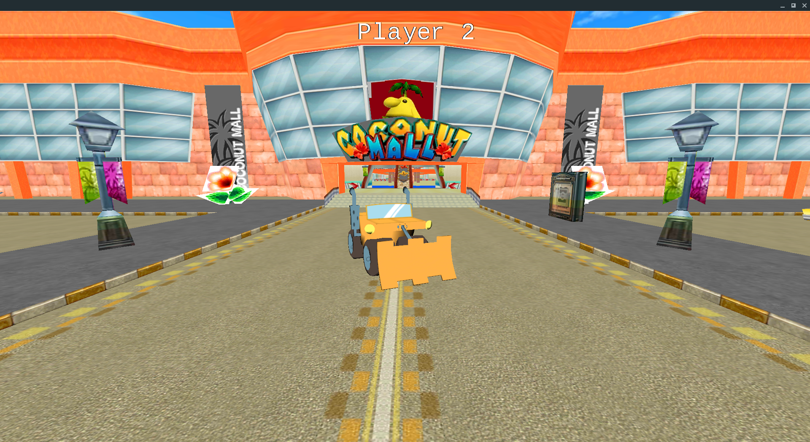
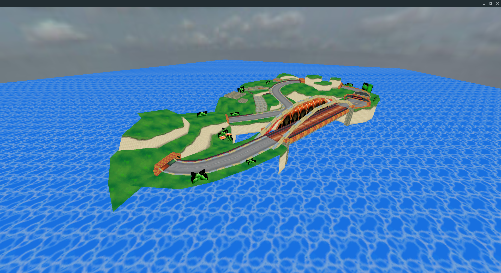

# CPP indie studio 2017

Realization of a car racing video game in C++ with Irrlicht engine in 2 weeks.  
A MVC architecture is used to allow independence of the different scenes (menu, game...).

## Platform

- [x] Linux

## Technologies used

  - Language : [C++ 14](http://www.cplusplus.com/)
  - GUI : [Irrlicht 1.8.4](http://irrlicht.sourceforge.net/)
  - Compilation : [Cmake](https://cmake.org/) & Makefile
  
# Installation

- Open a terminal
- Go to the root directory, and execute :
    ```
    ./quick_install.sh && cmake . && make
    ```
- Executable "cpp_indie_studio" will be generated at the root of the directory.

## Features

- Main menu
- Selection of 5 cars
- Selection of 2 course areas
- Selection of 2 view modes
  - Split view (one view for each users (2 users) and a view for the map)
  - No split view
- Score menu
- Power up
  - Life (recover a part of HP)
  - Speed charge (Car can use a boost of speed)
- Malus
  - Bomb (lost a part of HP)
- Physics of cars

## Screenshots

  
  
  
  
  
  


## Contributors

[Valentin Montagne](https://github.com/ValMont13)  
[Antoine Caffier](https://github.com/impakte)  
[Charles des Pommare](https://github.com/Charles-des-Pommare)  
[Vianney Doleans](https://github.com/VianneyDoleans)  
[Antoine Foret](https://github.com/eliastre100)  
[Guillaume Bouxin](https://github.com/GuillaumeBouxin)  
